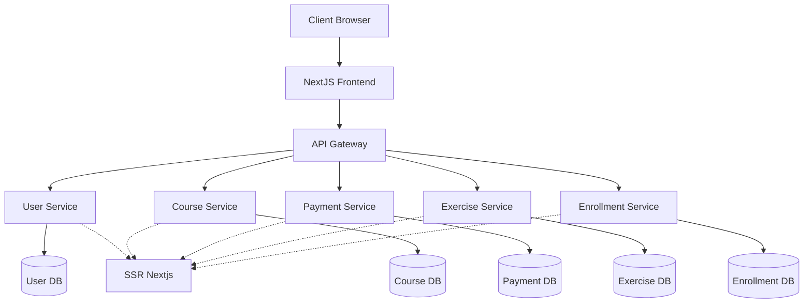
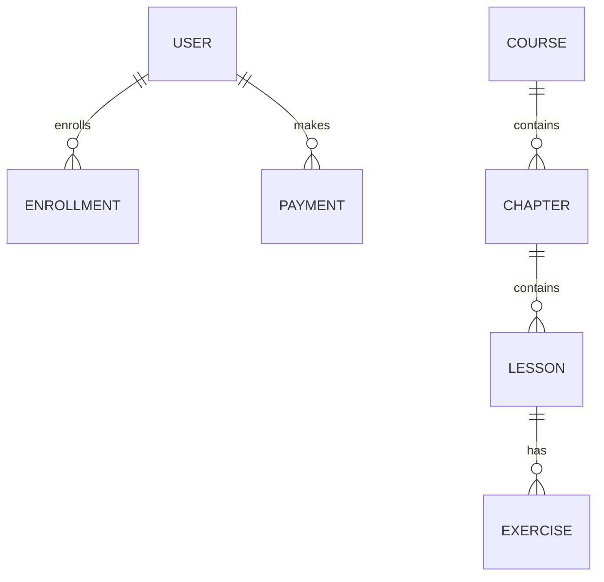
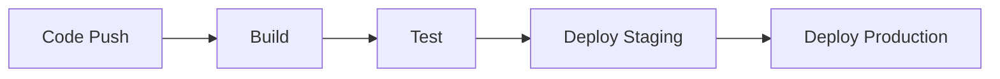

# Tổng Quan Dự Án E-learning Platform

## 🌐 Thông Tin Liên Hệ
- **Website**: [8syncdev.com](https://8syncdev.com)
- **GitHub**: [8 sync dev](https://github.com/8syncdev)
- **Tác giả**: Nguyễn Phương Anh Tú (Leader)
- **Liên hệ**: 0767449819

## 📋 Mục Lục
1. [Kiến Trúc Hệ Thống](#kiến-trúc-hệ-thống)
2. [Backend Service](#backend-service)
3. [Frontend Application](#frontend-application)
4. [Database Design](#database-design)
5. [Tính Năng Chính](#tính-năng-chính)
6. [Công Nghệ Sử Dụng](#công-nghệ-sử-dụng)
7. [Tài Liệu Tham Khảo](#tài-liệu-tham-khảo)

## 🏗 Kiến Trúc Hệ Thống



## 🔧 Backend Service

### Cấu Trúc Thư Mục
```
encore-backend/
├── src/
│   ├── app/
│   │   ├── module/
│   │   │   ├── enrollments/
│   │   │   ├── exercises/
│   │   │   ├── payments/
│   │   │   └── users/
│   ├── shared/
│   └── utils/
├── design/
└── tests/
```

### Microservices

#### Back end Encore được chia thành 5 microservices:

1. **User Service**
   - Xác thực & Phân quyền
   - Quản lý profile
   - Role-based access control

2. **Course Service**
   - CRUD khóa học
   - Quản lý chương/bài học
   - Tracking tiến độ học tập

3. **Enrollment Service**
   - Xử lý thanh toán dựa đăng ký khóa học
   - Quản lý giao dịch dùng realtime email sends.

4. **Exercise Service**
   - Quản lý bài tập
   - AI Assistant tích hợp
   - Chấm điểm tự động, phân luồng để theo dõi thời gian làm bài, dung lượng runtime để chấm điểm.

5. **Payment Service**
   - Xử lý tích hợp payment gateway

6. **Auth Service**
   - Identity Management từ User Service
   - Quản lý xác thực và phân quyền token (JWT)

#### Backend FastAPI LLM được viết bằng Python, sử dụng các model LLM từ Mistral, OpenAI, và LLaMA.

1. **LLM Service**
   - Giải bài tập từ Exercise Service của Backend Encore
   - Chống injestion attack
   - Phân tích sentiment của người dùng
   - Kiểm soát ngữ cảnh từ Exercise Service
   - Kiểm soát token vì mục đích thương mại

## 🎨 Frontend Application

### Cấu Trúc Thư Mục
```
nextjs-frontend/
├── app/
│   ├── (admin)/
│   │   ├── dashboard/
│   │   ├── courses/
│   │   └── users/
│   ├── (auth)/
│   └── (public)/
├── components/
└── lib/
```

### Tính Năng UI
1. **Dashboard**
   ```mermaid
   pie title Phân Bố Người Dùng
       "Học viên" : 45
       "Giảng viên" : 15
       "Admin" : 5
   ```

2. **Quản Lý Khóa Học**
   - Tạo/sửa/xóa khóa học
   - Upload video bài giảng
   - Quản lý nội dung markdown

## 💾 Database Design



## 🛠 Công Nghệ Sử Dụng

### Backend
#### Encore
- Encore Framework
- TypeScript
- PostgreSQL
- Cache: SSR NextJS
- Firebase Storage
- Firebase Auth
#### LLM FastAPI
- FastAPI
- Python Langchain

### Frontend
- Next.js 15 (Mới ra mắt vào tháng 11/2024)
- TailwindCSS (CSS)
- Shadcn UI (Component UI)
- React Query (Quản lý trạng thái và fetch dữ liệu)
- Framer Motion (Hiệu ứng động)

## 📚 Tài Liệu Tham Khảo

### Kiến Trúc
- [Microservices Pattern](https://microservices.io/patterns/index.html)
- [Clean Architecture](https://blog.cleancoder.com/uncle-bob/2012/08/13/the-clean-architecture.html)

### Công Nghệ
- [Encore Documentation](https://encore.dev/docs)
- [Next.js Documentation](https://nextjs.org/docs)
- [TailwindCSS](https://tailwindcss.com/docs)

## 🔄 CI/CD Pipeline



## 📊 Monitoring & Analytics

- Sử dụng Encore's built-in monitoring
- Error tracking với Sentry
- Performance monitoring với New Relic
- Custom analytics dashboard

## 🔐 Security

- JWT Authentication
- Role-based Authorization
- Indentity Management (via AuthService)
- API Rate Limiting
- SQL Injection Prevention
- XSS Protection
- CORS Policy

## 🚀 Deployment

- Backend: AWS với Encore Cloud
- Frontend: Vercel
- Database: Neon (PostgreSQL)
- Cache: SSR NextJS
- Storage: Firebase Storage

## 📈 Roadmap

1. Q1/2024: 
   - Tích hợp payment gateway
   - Nâng cấp AI assistant
   
2. Q2/2024:
   - Mobile app với React Native
   - Real-time collaboration features

3. Q3/2024:
   - Analytics dashboard
   - Performance optimization

4. Q4/2024:
   - Internationalization
   - Advanced reporting
